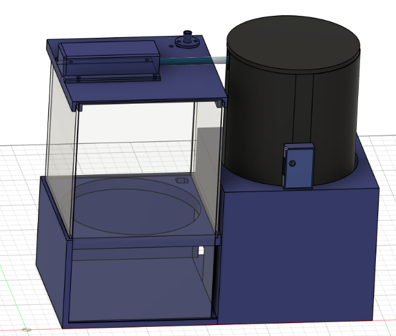
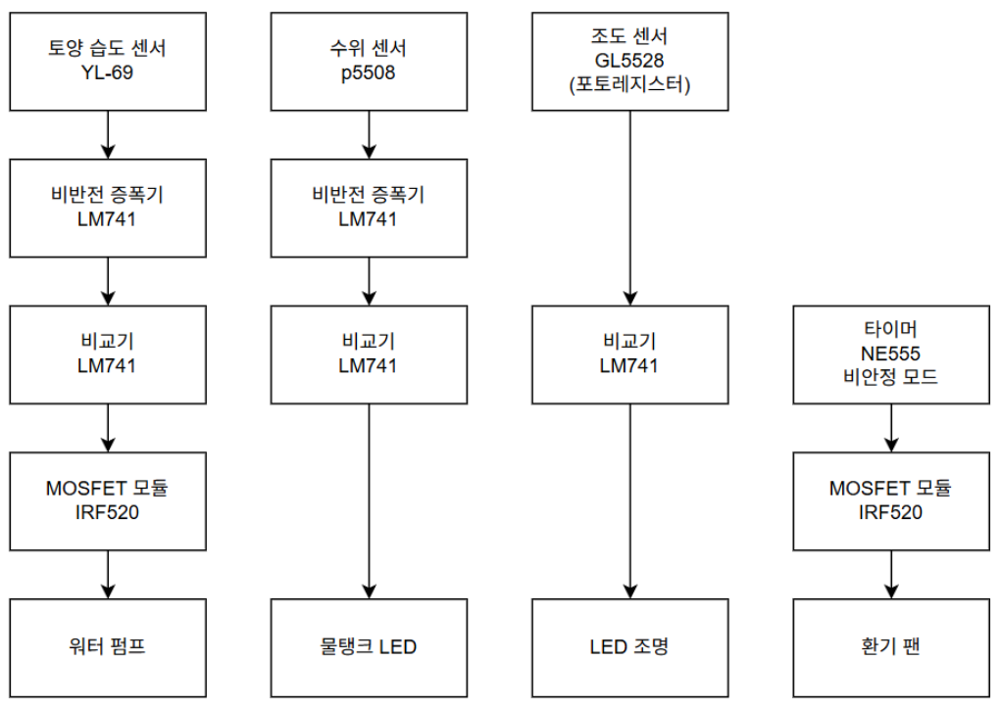
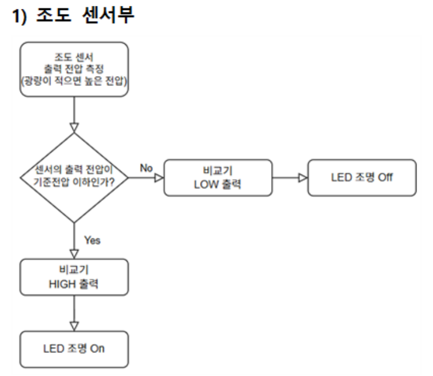
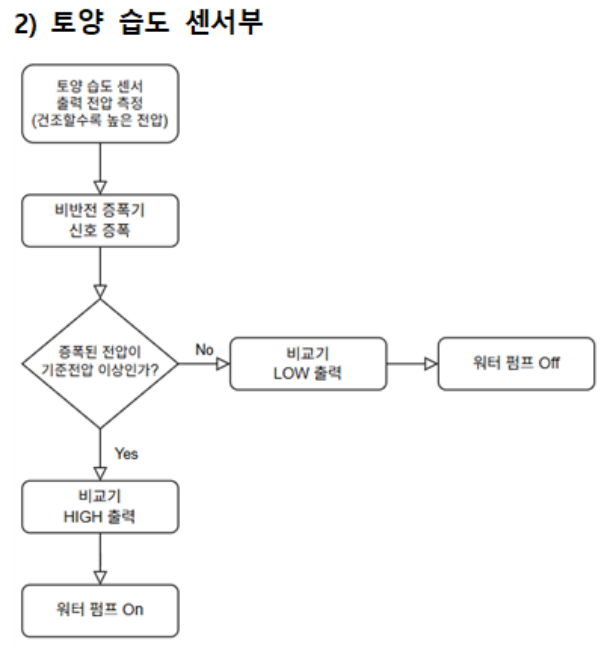
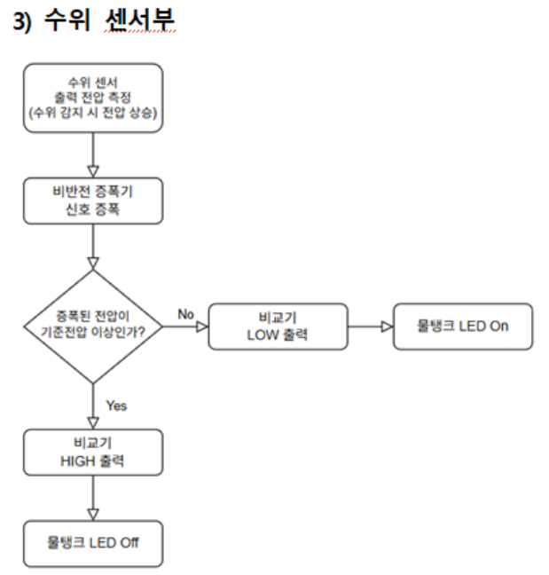
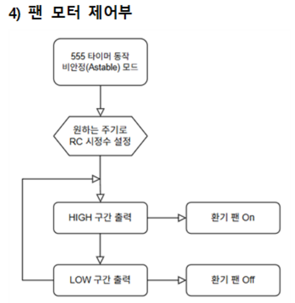

# 센서 기반 자동 식물 재배 시스템 (Analog)

> 아날로그 회로 실험 및 설계 수업 Term Project · **2025.10 – 2025.12** · 5인 팀 — 3D 모델링(외관 설계) 담당, 회로 구성·실험 보조

MCU 없이 **Op-Amp(LM741)와 NE555만으로** 동작하는 자동 식물 재배기입니다.
센서 신호를 비반전 증폭기로 키우고 비교기로 HIGH/LOW를 만들어 급수 펌프, 조명 LED, 물 부족 표시 LED, 환기 팬을 직접 제어합니다.
Multisim 시뮬레이션 → 브레드보드 실험 → PCB 제작 → 3D 프린팅 외관까지 완성했습니다.

<p align="center">
  
  &nbsp;
  
</p>

## 기능

| 기능 | 센서 / 소자 | 동작 |
|---|---|---|
| 자동 급수 | YL-69 토양 습도 센서 | 토양이 건조하면 워터 펌프 ON |
| 물 부족 알림 | P5508 수위 센서 | 물탱크 수위가 낮으면 청색 LED ON |
| 식물 조명 | GL5528 조도 센서 (CdS) | 밝은 환경(낮)에서 보라색(R+B) LED 조명 ON |
| 주기 환기 | NE555 비안정 모드 | 약 7.6 s ON / 6.9 s OFF 주기로 팬 동작 |

펌프와 팬은 IRF520 MOSFET 모듈로 구동합니다.

## Block Diagram

<p align="center"></p>

## Flow Chart

| 조도 센서부 | 토양 습도 센서부 |
|:---:|:---:|
|  |  |
| **수위 센서부** | **팬 모터 제어부** |
|  |  |

## 회로


| 블록 | 구성 | 기준 전압 | 출력 |
|---|---|:---:|---|
| [조도 센서부](docs/schematic_light.png) | CdS 분압 → LM741 비교기 | 1.5 V | 밝으면 HIGH → 조명 LED |
| [토양 습도 센서부](docs/schematic_soil.png) | 비반전 증폭(×2) → 비교기 | 2.7 V | 건조하면 HIGH → MOSFET → 펌프 |
| [수위 센서부](docs/schematic_water.png) | 비반전 증폭(×2) → 비교기 | 3.0 V | 물 부족 시 HIGH → 청색 LED |
| [팬 제어부](docs/schematic_fan.png) | NE555 비안정 (R1 = 10 kΩ, R2 = 100 kΩ, C = 100 µF) | — | 주기 구형파 → MOSFET → 팬 |

### 설계 포인트

- **센서 출력 2배 증폭**: 토양·수위 센서는 출력 변화 폭이 작아서, 비반전 증폭기(이득 1 + R<sub>f</sub>/R<sub>1</sub> = 2)로 키운 뒤 비교했습니다. 덕분에 히스테리시스 없이도 상태가 확실히 구분됐습니다.
- **기준 전압은 직접 측정해서 결정**: 토양·수위 센서는 데이터시트를 찾지 못해, 실제 흙과 물에서 출력 전압을 측정하고 가변저항으로 기준 전압을 맞췄습니다.
- **NE555 주기**

  ```
  T_H = 0.693 × (R1 + R2) × C = 0.693 × 110 kΩ × 100 µF ≈ 7.62 s
  T_L = 0.693 × R2 × C        = 0.693 × 100 kΩ × 100 µF ≈ 6.93 s
  ```

  시뮬레이션 측정값은 T<sub>H</sub> 7.615 s, T<sub>L</sub> 6.992 s로 이론값과 거의 일치했습니다.

## 3D 모델링

Fusion 360으로 외관을 설계하고 3D 프린팅했습니다. STL 파일은 GitHub에서 클릭하면 3D로 바로 볼 수 있어요.

| 파일 | 부품 | 크기 (mm) |
|---|---|---|
| [`main_base.stl`](models/main_base.stl) | 본체 하우징 | 130 × 130 × 120 |
| [`plant_pot.stl`](models/plant_pot.stl) | 화분 받침 | 140 × 130 × 80 |
| [`main_lid.stl`](models/main_lid.stl) | 본체 뚜껑 | 130 × 126 × 9 |
| [`main_lid_ldr_mount.stl`](models/main_lid_ldr_mount.stl) | 조도 센서 마운트 | 20 × 20 × 10 |
| [`main_lid_hose_cover.stl`](models/main_lid_hose_cover.stl) | 펌프 호스 덮개 | 80 × 46 × 20 |
| [`water_tank.stl`](models/water_tank.stl) | 물탱크 | 109 × 109 × 150 |
| [`water_tank_lid.stl`](models/water_tank_lid.stl) | 물탱크 뚜껑 | 110 × 110 × 8 |
| [`grow_led_holder.stl`](models/grow_led_holder.stl) | 조명 LED 홀더 | 65 × 21 × 7 |
| [`grow_led_cover.stl`](models/grow_led_cover.stl) | 조명 LED 덮개 (접착 고정) | 46 × 21 × 1 |
| [`water_level_led_holder.stl`](models/water_level_led_holder.stl) | 물 부족 표시 LED 케이스 | 24 × 37 × 10 |

## 부품 목록

| 부품 | 규격 | 수량 |
|---|---|:---:|
| Op-Amp | LM741 | 5 |
| 타이머 IC | NE555 | 1 |
| 센서 | YL-69 (토양 습도), P5508 (수위), GL5528 (조도) | 각 1 |
| MOSFET 모듈 | IRF520 | 2 |
| 워터 펌프 | 3–5 V, 130–240 mA | 1 |
| 팬 모터 | 5 V, 140 mA | 2 |
| LED | 청색 1, RGB 4핀 4 | 5 |
| 저항 | 330 Ω ×5, 1 kΩ ×4, 10 kΩ ×2, 100 kΩ ×1 | 12 |
| 가변저항 | 10 kΩ | 3 |
| 커패시터 | 0.1 µF 세라믹, 100 µF 전해 | 각 1 |
| 전원 | 6 V 배터리 (±6 V) | 3 |
| 스위치 | MTS-203 토글 | 1 |
| PCB | 주문 제작 | 1 |

## 결과

### 시뮬레이션 (Multisim)

| 조도 센서부 | 수위 센서부 | NE555 팬 제어부 |
|:---:|:---:|:---:|
|  |  |  |

### 오실로스코프 측정 (CH1: 기준 전압, CH2: 센서 출력)

| 조도: 밝을 때 / 어두울 때 | 토양: 건조 / 습함 | 수위: 부족 / 충분 |
|:---:|:---:|:---:|
| <br> | <br> | <br> |

| 비반전 증폭 ×2 (1.5 V → 3 V) | NE555 출력 주기 |
|:---:|:---:|
|  |  |

### 제작

| 브레드보드 | PCB 아트워크 | PCB 완성 |
|:---:|:---:|:---:|
|  |  |  |

동작 영상: [`videos/final_demo.mp4`](videos/final_demo.mp4)

## 고찰

- 비교기에 히스테리시스를 넣으면 경계 근처에서 출력이 더 안정적이겠지만, 센서 출력을 2배 증폭해 상태 구분이 명확했기 때문에 필수는 아니라고 판단했습니다.
- NE555 주기를 고정저항으로 정해서 주기를 바꿀 수 없습니다. 가변저항을 쓰면 원하는 주기로 조절할 수 있습니다.
- 조명은 주변 광량 기준이라, 센서가 가려지면 조명이 무조건 꺼지는 한계가 있습니다.
- LM324 같은 다채널 Op-Amp를 쓰면 소자 수를 줄일 수 있지만, ±6 V 전원에서는 원하는 출력이 나오지 않아 LM741을 사용했습니다.

## 참고 자료

- [YL-69 Soil Moisture Sensor Guide](https://randomnerdtutorials.com/guide-for-soil-moisture-sensor-yl-69-or-hl-69-with-the-arduino/)
- [LM741 Datasheet](https://www.alldatasheet.com/html-pdf/840177/TI1/LM741/226/4/LM741.html)
- [555 Timer Astable Mode](https://www.electronics-tutorials.ws/waveforms/555_oscillator.html)
- [GL5528 Datasheet](https://www.alldatasheet.com/html-pdf/1131893/ETC2/GL5528/227/2/GL5528.html)
