# Auto Plant Grower — 센서 기반 자동 식물 재배 시스템

> 아날로그 회로 실험 및 설계 수업 Term Project · **2025.10 – 2025.12** · 5인 팀 — 3D 모델링(외관 설계) 담당, 회로 구성·실험 보조

MCU 없이 **Op-Amp(LM741)와 NE555만으로** 동작하는 자동 식물 재배기입니다. 센서 신호를 비반전 증폭기로 키우고 비교기로 HIGH/LOW를 만들어 급수 펌프, 식물 조명, 물 부족 알림 LED, 환기 팬을 직접 제어합니다.
Multisim 시뮬레이션 → 브레드보드 실험 → PCB 제작 → 3D 프린팅 외관까지 완성했습니다.

| 항목 | 내용 |
|---|---|
| 입력 | YL-69 토양 습도, P5508 수위, GL5528 조도(CdS) 센서 |
| 출력 | 워터 펌프, 보라색(R+B) 식물 조명 LED, 물 부족 알림 청색 LED, 환기 팬 ×2 |
| 신호 처리 | LM741 비반전 증폭(×2) → LM741 비교기 (기준 전압 1.5 / 2.7 / 3.0 V) |
| 타이머 | NE555 비안정 모드, 팬 ON 7.6 s / OFF 6.9 s 주기 |
| 구동 | IRF520 MOSFET 모듈 ×2 (펌프 · 팬) |
| 전원 | 6 V 배터리 ×3 (±6 V), 토글 스위치 |
| 외관 | Fusion 360 설계 · 3D 프린팅 (본체 + 물탱크, 260 × 131 × 257 mm) |

<p align="center">
  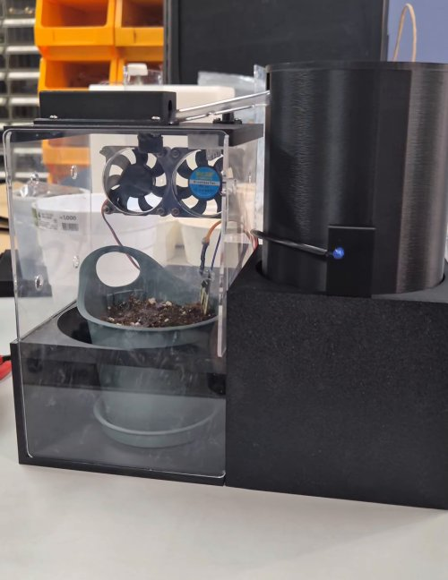
  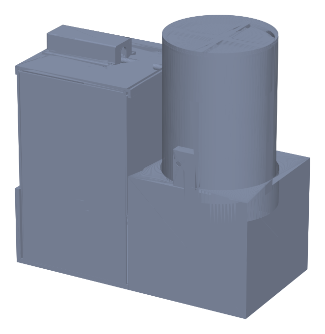
  <br><sub>왼쪽 최종 완성품 · 오른쪽 전체 조립 3D 모델</sub>
</p>

---

## 시스템 구조

<p align="center">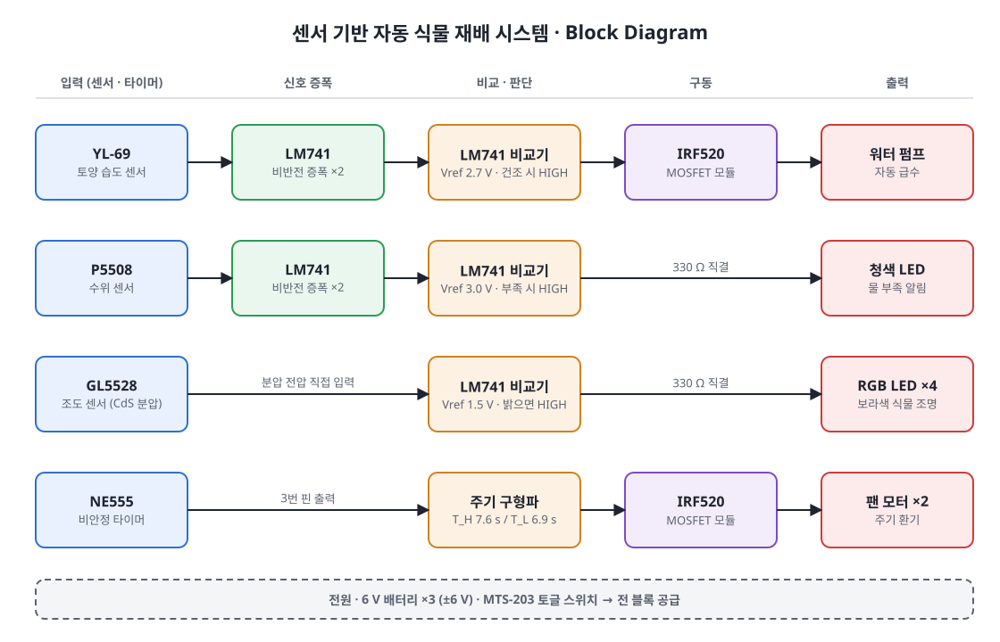</p>

### 동작 원리

| 블록 | 구성 | 기준 전압 | 동작 |
|---|---|:---:|---|
| 토양 습도 | 비반전 증폭(×2) → 비교기 | 2.7 V | 건조하면 HIGH → MOSFET → 펌프 ON |
| 수위 | 비반전 증폭(×2) → 비교기 | 3.0 V | 물 부족 시 HIGH → 청색 LED ON |
| 조도 | CdS 분압 → 비교기 | 1.5 V | 밝으면 HIGH → 식물 조명 ON |
| 환기 | NE555 비안정 (R1 = 10 kΩ, R2 = 100 kΩ, C = 100 µF) | — | 주기 구형파 → MOSFET → 팬 |

```
T_H = 0.693 × (R1 + R2) × C = 0.693 × 110 kΩ × 100 µF ≈ 7.62 s
T_L = 0.693 × R2 × C        = 0.693 × 100 kΩ × 100 µF ≈ 6.93 s
```

### 제어 흐름

네 블록은 MCU 없이 각자의 아날로그 회로로 **동시에, 독립적으로** 동작합니다.

<p align="center">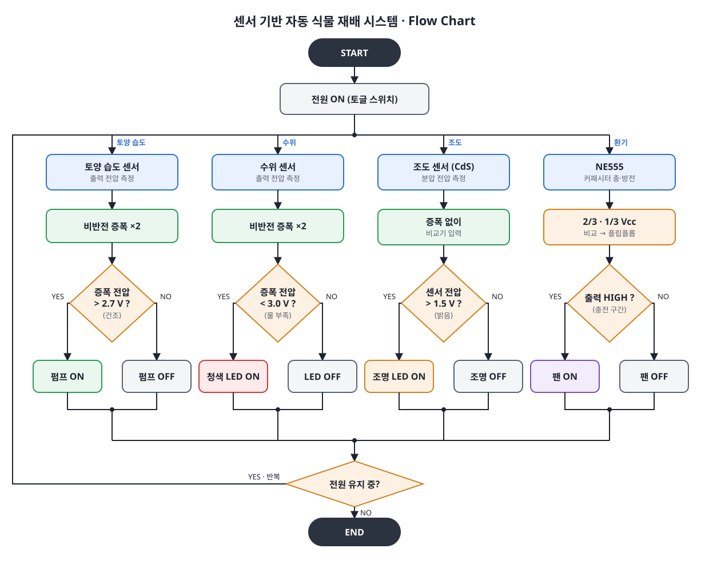</p>

---

## 폴더 구조

```
analog-auto-plant-system/
├─ docs/                블록도 · 플로우차트 · 전체/블록별 회로도
├─ models/              3D 프린팅 STL
│  ├─ assembly.stl      전체 조립 모델
│  └─ *.stl             부품별 출력 파일 (10개)
├─ images/              시뮬레이션, PCB, 3D, 완성품 사진
│  └─ scope/            오실로스코프 측정 사진
└─ videos/              최종 동작 영상
```

---

## 하드웨어

### 회로도

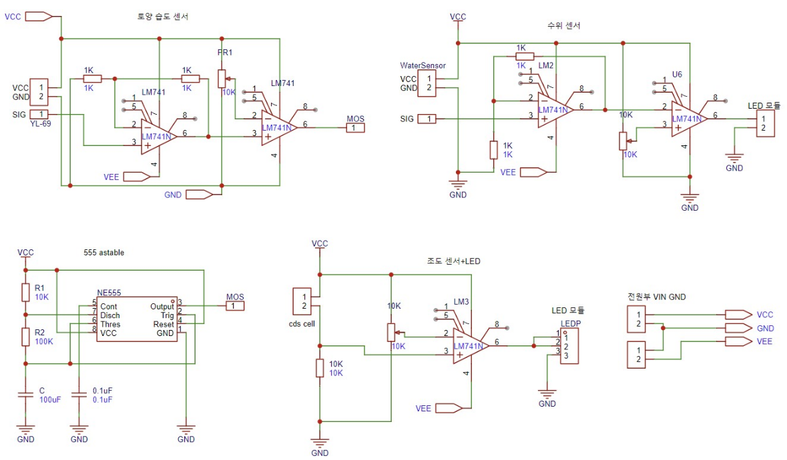

블록별 회로도: [조도](docs/schematic_light.png) · [토양 습도](docs/schematic_soil.png) · [수위](docs/schematic_water.png) · [NE555 팬 제어](docs/schematic_fan.png)

### PCB

| 브레드보드 | PCB 아트워크 | PCB 완성 |
|:---:|:---:|:---:|
| 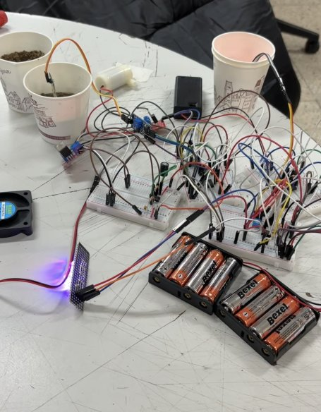 | 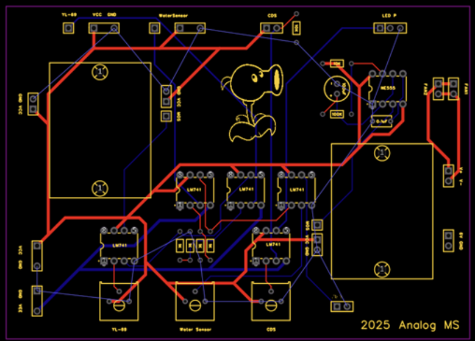 | 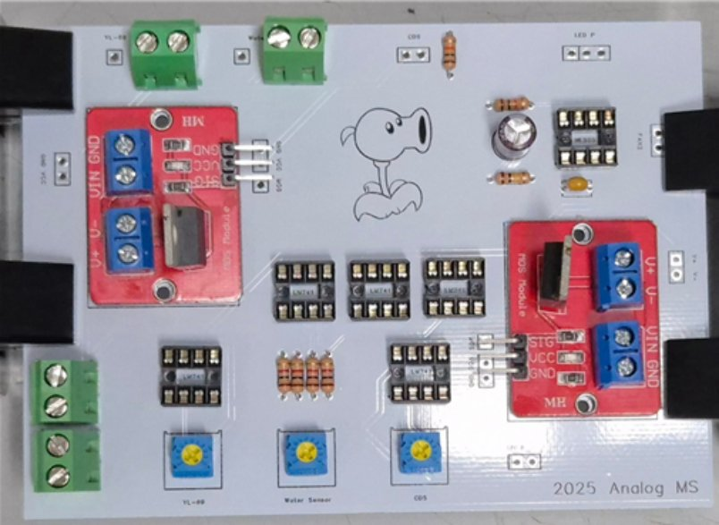 |

### 기구부 (3D 모델링 — 담당)

Fusion 360으로 외관을 설계하고 3D 프린팅했습니다. STL 파일은 GitHub에서 클릭하면 3D로 바로 볼 수 있습니다.

| 파일 | 부품 | 크기 (mm) |
|---|---|---|
| [`assembly.stl`](models/assembly.stl) | **전체 조립 모델** | 260 × 131 × 257 |
| [`main_base.stl`](models/main_base.stl) | 본체 하우징 | 130 × 130 × 120 |
| [`plant_pot.stl`](models/plant_pot.stl) | 화분 받침 | 140 × 130 × 80 |
| [`main_lid.stl`](models/main_lid.stl) | 본체 뚜껑 | 130 × 126 × 9 |
| [`main_lid_ldr_mount.stl`](models/main_lid_ldr_mount.stl) | 조도 센서 마운트 | 20 × 20 × 10 |
| [`main_lid_hose_cover.stl`](models/main_lid_hose_cover.stl) | 펌프 호스 덮개 | 80 × 46 × 20 |
| [`water_tank.stl`](models/water_tank.stl) | 물탱크 | 109 × 109 × 150 |
| [`water_tank_lid.stl`](models/water_tank_lid.stl) | 물탱크 뚜껑 | 110 × 110 × 8 |
| [`grow_led_holder.stl`](models/grow_led_holder.stl) | 조명 LED 홀더 | 65 × 21 × 7 |
| [`grow_led_cover.stl`](models/grow_led_cover.stl) | 조명 LED 덮개 (접착 고정) | 46 × 21 × 1 |
| [`water_level_led_holder.stl`](models/water_level_led_holder.stl) | 물 부족 표시 LED 케이스 | 24 × 37 × 10 |

- 본체(화분·회로 수납)와 원통형 물탱크를 나란히 배치하고, 펌프 호스는 뚜껑의 호스 덮개로 정리
- 조도 센서는 본체 뚜껑 위 전용 마운트에 고정해 주변 광량을 받도록 배치
- 물탱크 뚜껑은 출력·결합 테스트를 거쳐 3차 수정본까지 개선

### 부품

| 부품 | 규격 | 수량 |
|---|---|:---:|
| Op-Amp | LM741 | 5 |
| 타이머 IC | NE555 | 1 |
| 센서 | YL-69 (토양 습도), P5508 (수위), GL5528 (조도) | 각 1 |
| MOSFET 모듈 | IRF520 | 2 |
| 워터 펌프 / 팬 모터 | 3–5 V 130–240 mA / 5 V 140 mA | 1 / 2 |
| LED | 청색 1, RGB 4핀 4 | 5 |
| 저항 / 가변저항 | 330 Ω ×5, 1 kΩ ×4, 10 kΩ ×2, 100 kΩ ×1 / 10 kΩ ×3 | 15 |
| 커패시터 | 0.1 µF 세라믹, 100 µF 전해 | 각 1 |
| 전원 / 스위치 | 6 V 배터리 / MTS-203 토글 | 3 / 1 |

---

## 결과

### 시뮬레이션 (Multisim)

| 조도 센서부 | 수위 센서부 | NE555 팬 제어부 |
|:---:|:---:|:---:|
| 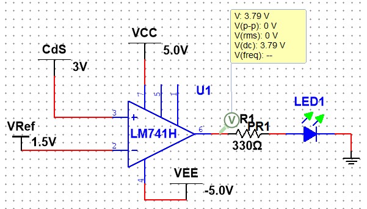 | 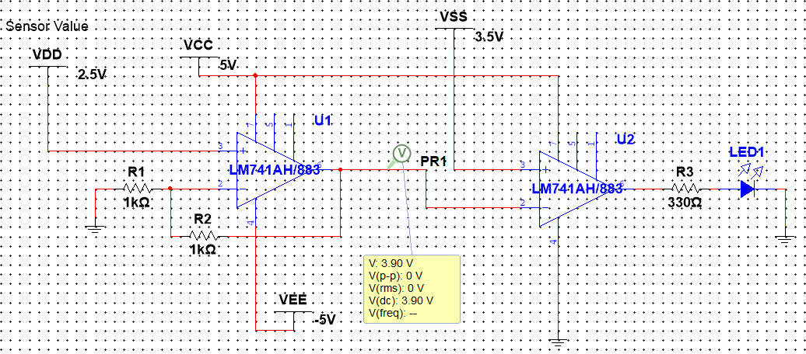 | 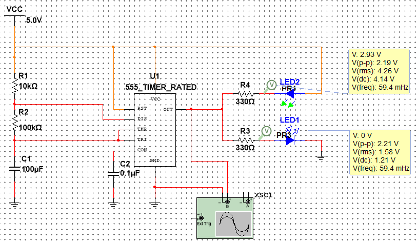 |

NE555 주기: 이론 T<sub>H</sub> 7.623 s / T<sub>L</sub> 6.93 s → 시뮬레이션 **7.615 s / 6.992 s**

### 오실로스코프 측정 (CH1: 기준 전압, CH2: 센서 출력)

| 조도: 밝을 때 / 어두울 때 | 토양: 건조 / 습함 | 수위: 부족 / 충분 |
|:---:|:---:|:---:|
| <br>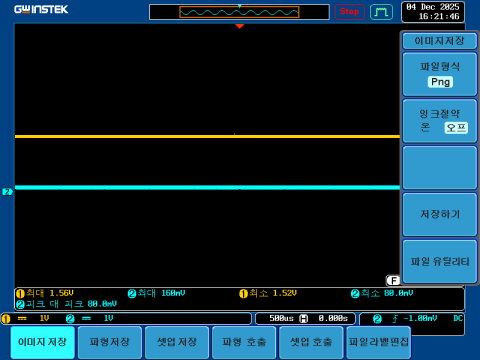 | 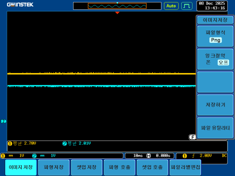<br>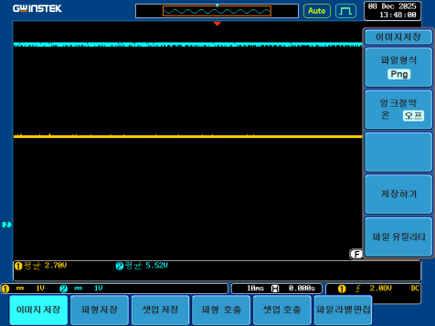 | 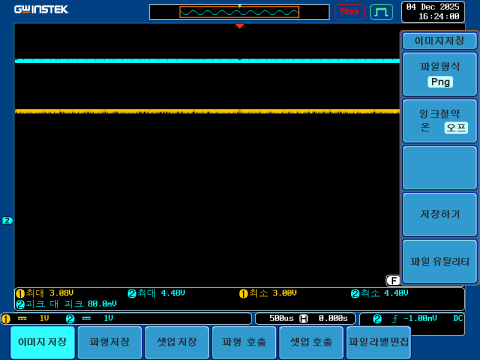<br>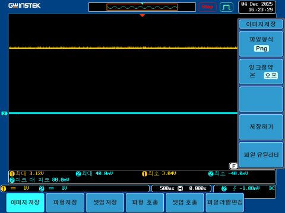 |
| 3.4 V / 약 0 V (기준 1.5 V) | 5.5 V / 2 V (기준 2.7 V) | 약 0 V / 4.4 V (기준 3 V) |

| 비반전 증폭 ×2 (1.5 V → 3 V) | NE555 출력 주기 |
|:---:|:---:|
|  | 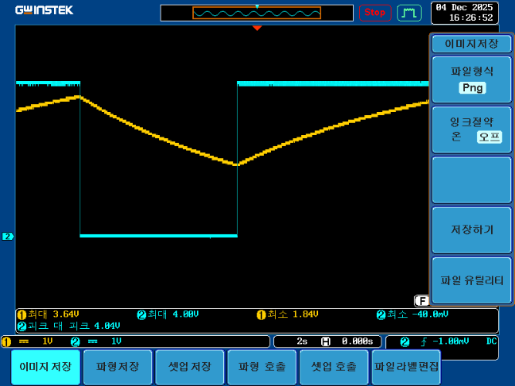 |

동작 영상: [`videos/final_demo.mp4`](videos/final_demo.mp4)

---

## 내 담당 범위

5인 팀 프로젝트에서 제가 담당한 부분입니다.

| 파트 | 내용 |
|---|---|
| 기구 | 본체 · 화분 받침 · 물탱크 · 뚜껑 · 센서/LED 마운트 등 외관 전체 3D 모델링 및 출력 (Fusion 360) |
| 회로 | 브레드보드 회로 구성 |
| 실험 | 센서 출력 측정, 오실로스코프 실험 보조 |

---

## 트러블슈팅

### 1. 센서 데이터시트 부재
- **증상**: 토양 습도·수위 센서의 출력 특성을 알 수 없어 비교기 기준 전압을 정할 수 없음
- **해결**: 실제 흙(건조/습함)과 물(부족/충분) 조건에서 출력 전압을 직접 측정하고, 가변저항으로 기준 전압을 맞춤

### 2. 센서 출력 변화 폭이 작음
- **증상**: 상태가 바뀌어도 센서 출력 차이가 작아 비교기 판정이 경계에서 불안정
- **해결**: 비반전 증폭기로 2배 증폭한 뒤 비교 → 상태별 전압 차가 커져 히스테리시스 회로 없이도 판정이 안정됨

### 3. 다채널 Op-Amp(LM324) 출력 불량
- **증상**: 소자 수를 줄이려 LM324를 썼지만 원하는 출력이 나오지 않음
- **원인**: ±15 V가 아닌 ±6 V 배터리 전원에서 LM741과 소자 특성이 달라진 것으로 추정
- **해결**: 수업에서 검증한 LM741로 통일 (블록당 1개씩, 총 5개)

### 4. 6 V 전원으로 모터·펌프 직접 구동 불가
- **증상**: 비교기·NE555 출력만으로는 팬과 펌프를 돌릴 전류가 부족
- **해결**: IRF520 MOSFET 모듈을 스위치로 사용해 제어 신호와 구동 전원을 분리

### 5. 조명 제어 방식의 한계 (개선 과제)
- 처음엔 NE555로 조명 주기를 만들려 했지만 주기가 길어질수록 오차가 커져 조도 센서 방식으로 변경
- 현재는 센서가 가려지면 조명이 꺼지는 한계가 있고, NE555 주기도 고정저항이라 조절 불가 → 가변저항 · 다른 제어 방식으로 개선 가능

---

## 실행 방법

### 1. 기구 출력
- `models/*.stl`을 슬라이서에서 열어 3D 프린터로 출력 (`assembly.stl`은 조립 확인용)
- `grow_led_cover.stl`은 출력 후 LED 홀더에 접착제로 고정

### 2. 동작
- 토글 스위치로 전원 ON → 네 블록이 센서 값에 따라 자동 동작
- 기준 전압은 각 비교기 옆 10 kΩ 가변저항으로 환경에 맞게 조정

---

## 기술 스택
`NI Multisim` · `Op-Amp (LM741) 증폭기 · 비교기` `NE555` · `Fusion 360` `3D 프린팅` · `오실로스코프`

## 라이선스 / 출처
- 회로 및 기구 설계는 팀에서 직접 작성했으며, 블록도·플로우차트는 결과보고서를 바탕으로 다시 그렸습니다.
- 참고: [YL-69 Soil Moisture Sensor Guide](https://randomnerdtutorials.com/guide-for-soil-moisture-sensor-yl-69-or-hl-69-with-the-arduino/) · [LM741 Datasheet](https://www.alldatasheet.com/html-pdf/840177/TI1/LM741/226/4/LM741.html) · [555 Astable Mode](https://www.electronics-tutorials.ws/waveforms/555_oscillator.html) · [GL5528 Datasheet](https://www.alldatasheet.com/html-pdf/1131893/ETC2/GL5528/227/2/GL5528.html)
